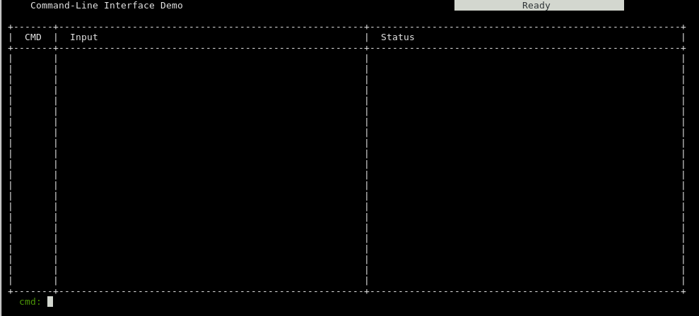
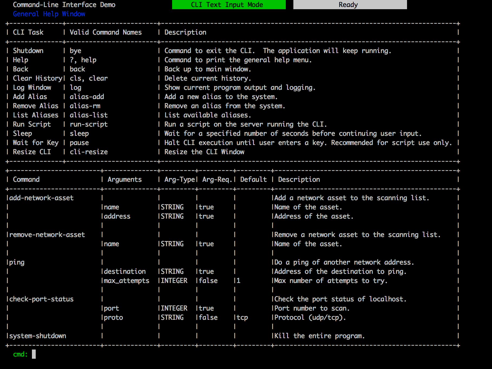
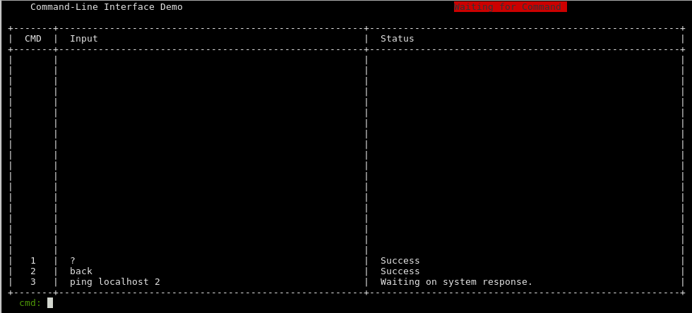
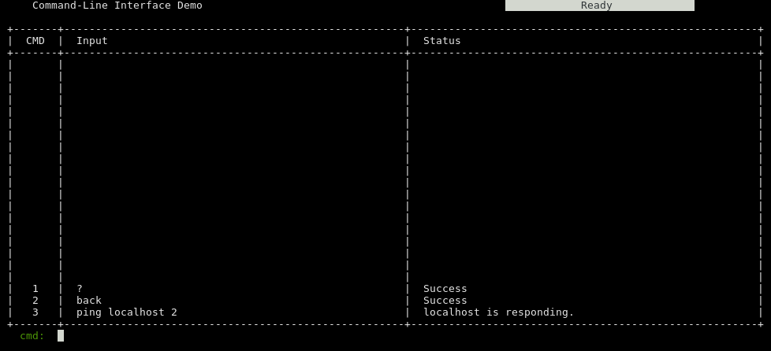
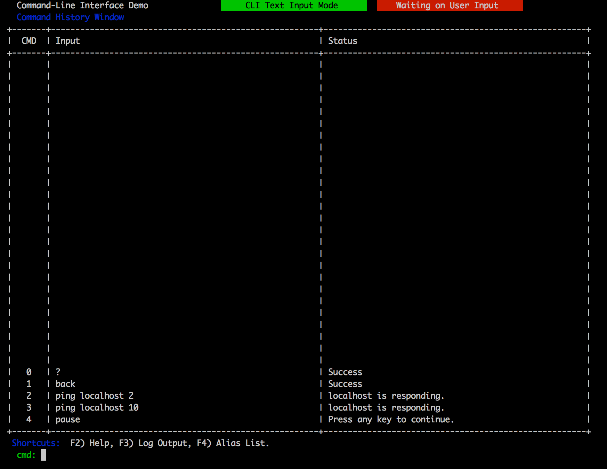
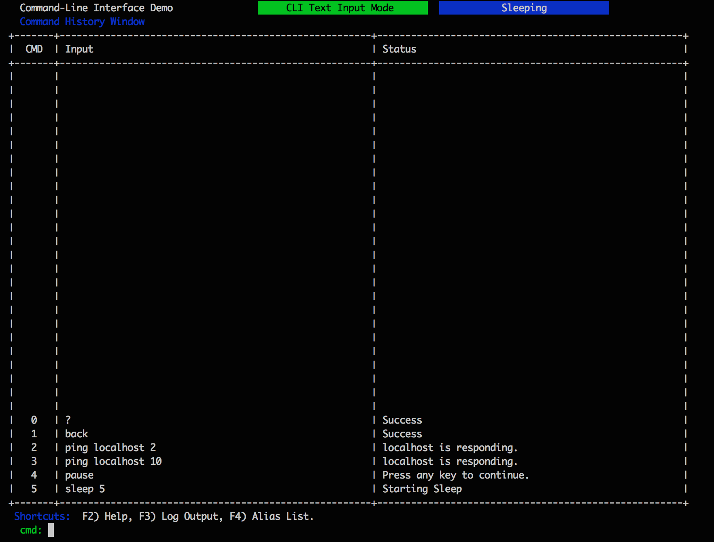

# CLI-C++ #

A Command-Line Interface (CLI) for use in C++ programs.

## Overview ##

The purpose of this project is to provide C++ programmers with a Command-Line Interface which they can 
tie into their existing projects.  This seeks to allow connecting to your application via the local 
process or via a TCP socket.  

All arguments are controlled via a configuration file which consists of several CLI commands plus the user-defined
commands.  The command name, arguments, types, and response expectations can be provided.

## Building ##

CLI-CPP has some basic requirements.  I have only 
tested this on Linux (Ubuntu/Fedora) and MacOS X with MacPorts

### Dependencies ###
 - Boost
 - pthreads (`std::thread`)
 

### Compiling ###

CLI-CPP is constructed using the CMake build system.  Just do the following.

    mkdir -p release
    pushd release
    cmake ..
    make 
    popd

Note that it will probably fail the first time due to pugixml missing.  To initialize from the base
directory...

    git submodule update --init src/lib/cli_cpp/thirdparty/pugixml

Documentation can be constructed using Doxygen with 

    doxygen docs/Doxyfile

###  Test Application ###

CLI-CPP comes with a basic test application to demonstrate core capabilities.  To run...

    cd release
    ./bin/cli-network-tester ../data/CLI_Manager_Configuration.xml

    # On a separate terminal, 
    telnet localhost 12344

For the demo, the supported commands are shown below.  Tab-complete works for both commands and arguments.  Check the configuration 
file for arguments with tab-complete support.

1. system-shutdown
  - Shut down application.
2. ping <host-required> <num-tries optional>
  - ping a network address.
3. netstat <port-required> <protocol optional>
  - check if a port is open.

### CLI Main Window ###

### CLI Help Menu (?, help)###

### CLI Ping Command ###

### CLI Ping Command Complete ###

### Pause Command ###

### Sleep Command ###

